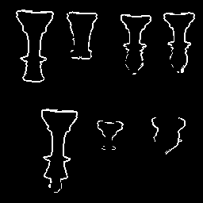

<h1 align="center">Elementary Edge Detection</h1>

<p align="center">
  <em>Featuring the "Sobel" and "Canny" operators.</em>
</p>

Input a source PGM image...:


...to produce the following:

<table>
    <tr><th>Magnitude</th><th>Low Threshold</th><th>High Threshold</th></tr>
    <tr>
        <td></td>
        <td></td>
        <td></td>
    </tr>
</table>

All within the confines of a simple CLI-based interface:
```sh
# Magnitude version of image, using the sobel operator.
eed sobel --input chess.pgm --output chess_magnitude.pgm

# Same thing, but low threshold
eed sobel --input chess.pgm --output chess_low.pgm --threshold 0.2 # where "--threshold" is a value in the unit interval set.
```
## Install
Assuming you have the `go` command and tool-chain already installed, run the following:
```sh
go install github.com/thatpix3l/eed/eed@latest
eed --help
```